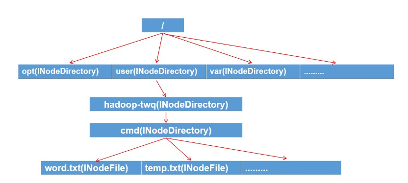

 [中文](README.md) | [English](README-eh.md)

# 元数据查询优化系统

## 📖 项目简介

传统文件系统只支持「目录树遍历」式查询，在大规模场景下性能急剧下降。  本项目提出并实现了一种高效的 **文件系统元数据查询优化方案**。通过在目录树结构之外引入 **倒排索引**，并结合 **Varint 编码压缩**、**读写锁机制** 和 **线程安全数据结构**，实现了在大规模文件系统下的高效查询与并发优化。实验表明，本系统在查询性能和内存占用方面均有显著提升。

## ✨ 主要特性

- **倒排索引优化查询**：支持快速定位特定元数据文件，避免线性遍历目录树。
- **Varint 压缩**：显著减少倒排索引的存储空间。
- **高并发支持**：引入读写锁机制与 `ConcurrentHashMap`，保证一致性和性能。
- **灵活的数据结构**：支持目录树管理和范围索引，满足多样化查询需求。
- **实验验证**：在大规模数据（25 万文件）下验证了查询性能与内存优化效果。

## 🏗️ 系统架构

系统主要由两大核心模块组成：

1. **文件系统管理（FSDirectory）**
   - 目录树结构管理
   - 文件/目录的创建、删除、更新、查询
2. **倒排索引（InvertedIndex）**
   - 支持字符串型与数值型元数据的索引
   - 范围分片机制提升范围查询效率
   - Varint 编码压缩优化存储空间



## 📂 项目结构

```
├── src/
│   └── main/
│       └── java/
│           ├── FS/         # 文件系统管理相关类 / File system management classes
│           ├── index/      # 倒排索引相关类 / Inverted index classes
│           ├── utils/      # 工具类 / Utilities
│           ├── TestFS.java # 测试入口 / Test entry
│           └── readme.md   # 说明文档 / Documentation
├── target/                 # 编译输出 / Compiled output
├── pom.xml                 # 构建配置 / Build config
├── README.md               # 项目说明 / Project description
└── project-details.docx    # 项目文档 / Project documentation
```

## ⚙️ 环境要求

- **操作系统**：Ubuntu 20.04 或以上（建议）
- **编程语言**：Java 11+
- **硬件**：推荐 16GB 内存及以上

## 🚀 快速开始

1. 克隆仓库：

   ```bash
   git clone https://github.com/yangeh03/metadata-query-optimizer.git
   cd metadata-query-optimizer
   ```

2. 编译所有 Java 文件：

   ```bash
   javac -d out src/main/java/**/*.java
   ```

3. 运行主测试类（包含全部评测）：

   ```bash
   java -cp out TestFS
   ```

4. 或使用 Maven 编译（如需单元测试）：

   ```bash
   mvn compile
   mvn test
   ```

## 📊 实验结果

- **查询性能**：倒排索引相比目录树查询速度提升 **数十倍**，尤其在大规模文件下表现显著。
- **内存优化**：Varint 压缩使索引占用空间减少至原来的 **20%–25%**。
- **并发性能**：在 10 万文件规模下，并发查询耗时降低超过 **10 倍**。

好的 👍 我帮你写一个英文版本的 **README.md**，适合直接放在 GitHub 上。


